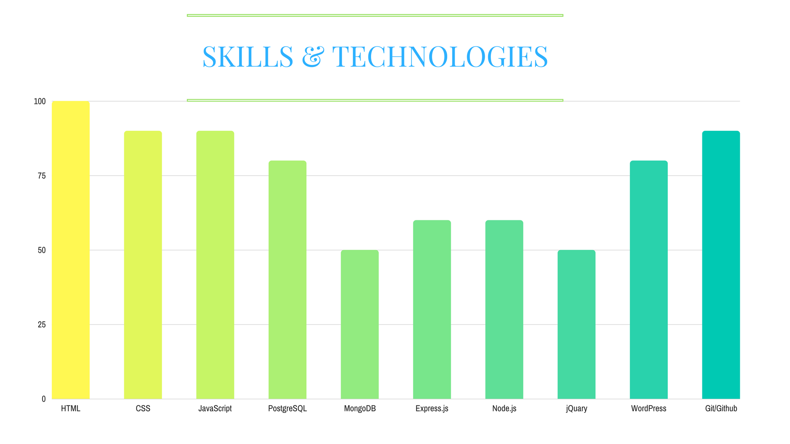

# **Vered Rekanati Mordechai**

### 6181 St. Nazareth, Israel
### :telephone_receiver: +972-55-669-2604  :envelope: veredrec@gmail.com

##### Aiming to make the world a better place through technology and nonstandard education. I offer a combination of strong interpersonal skills and a solid foundation in software development. I bring experience from 10 years as a leader in the Non-Profit and Education sectors in Israel, the U.S., and Italy. Currently a student at Founders and Coders Nazareth, a competitive Full Stack Web Development Bootcamp.

### Skills and Technologies:

  

<!--  -->

### Projects:
<!-- ###### (All projects were made as a part of my studies at Founders & Coders, in a collaborative work with my peers) -->
#### [Something Good](https://github.com/veredrec/Something-Good)
A Web Platform for Volunteering Events in Nazareth

#### [Noor](https://github.com/veredrec/noor)
 Prototype for a web application which aims to improve the quality of life for people with disabilities and their caregivers

#### [Facnsters](https://github.com/veredrec/Facnsters)
An application to look up FAC members in Nazareth

#### [Feed Me](https://github.com/veredrec/HackRU_FeedMe)
 Web App that provides information about restaurants and nutrition values. Uses Amazon Echo and a wide database.
 Won a prize for using Amazon Services.

### Employment History:
##### Research Assistant, Princeton University (2016-2017)
* Analyzed sources from the Cairo Geniza
* Assisted in establishing an open database for researchers and the public

##### Educator at Hatikvah International Academy Charter School, NJ (2013-2016)
* Taught Math, Science, Hebrew, and Israeli studies
* Initiated a new year-long program for heritage Hebrew speakers

##### WZO Fellow at the Jewish Community in Genoa, Italy (2015)
* Community building and management
* Coordinated programs for the young adult sector

##### Director of the program "Remember and Honor" at Hillel, the Hebrew University (2009-2011)
* Mentored year-long programs in which students introduced technology to Holocaust survivors
* Increased the program's budget and size by 100% each through independent fundraising

### Voluntary Service with Non-Profits:
* President of ISPPU, a community building organization for internationals at Princeton University
* Translator for ASSAF, an aid organization for refugees and asylum seekers
* Two year elected Student Union Representative

### Education:
* **Master of Arts** in History and Contemporary Jewish Studies, The Hebrew University in Jerusalem
* **Bachelor of Arts** in History and Jewish Thought, The Hebrew University in Jerusalem

### Languages:
* Fluent in English and Hebrew
* Intermediate level in Italian and Spanish
